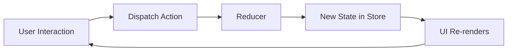
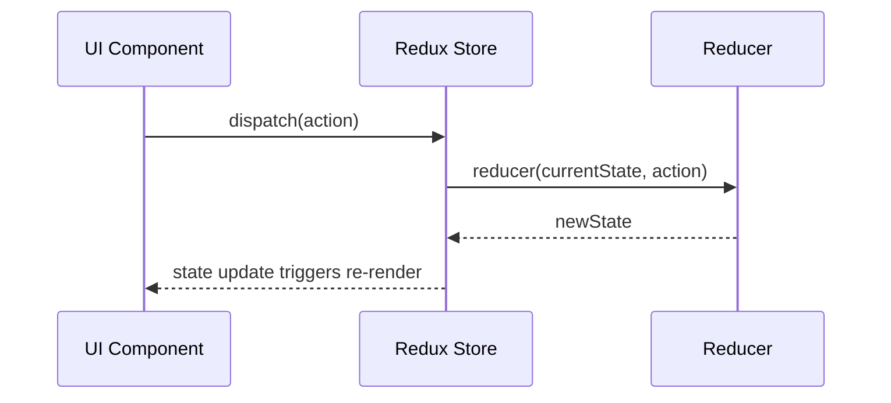
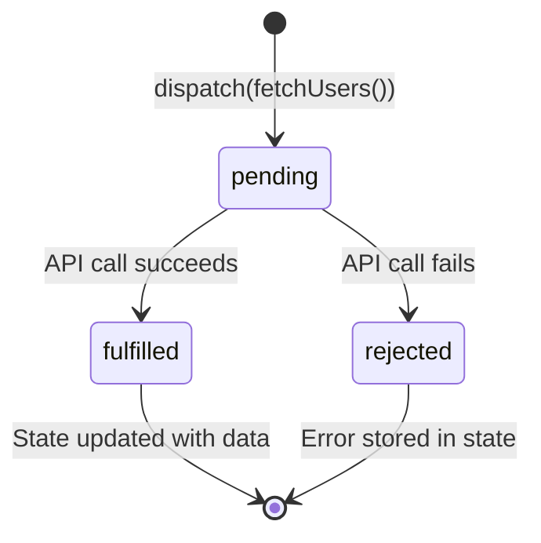

# Redux Toolkit: The Complete Guide
### From Beginner to Enterprise-Level Architecture

> **A production-quality reference for personal notes, interview prep, team onboarding, and course material.**

---

## Table of Contents

1. [Introduction to State Management](#1-introduction-to-state-management)
2. [Core Redux Concepts](#2-core-redux-concepts)
3. [Problems with Traditional Redux](#3-problems-with-traditional-redux)
4. [Introduction to Redux Toolkit](#4-introduction-to-redux-toolkit)
5. [Project Setup](#5-project-setup)
6. [Understanding createSlice()](#6-understanding-createslice)
7. [Understanding configureStore()](#7-understanding-configurestore)
8. [React Redux Integration](#8-react-redux-integration)
9. [Building a Complete Counter App](#9-building-a-complete-counter-app)
10. [Building a Todo Application](#10-building-a-todo-application)
11. [Async Operations with createAsyncThunk](#11-async-operations-with-createasyncthunk)
12. [Extra Reducers](#12-extra-reducers)
13. [RTK Query (Advanced)](#13-rtk-query-advanced)
14. [Redux Toolkit Folder Structure](#14-redux-toolkit-folder-structure)
15. [Redux Toolkit Middleware](#15-redux-toolkit-middleware)
16. [Performance Optimization](#16-performance-optimization)
17. [Redux DevTools](#17-redux-devtools)
18. [Authentication Example](#18-authentication-example)
19. [Best Practices](#19-best-practices)
20. [Common Mistakes](#20-common-mistakes)
21. [Interview Questions](#21-redux-toolkit-interview-questions)
22. [Cheat Sheet](#22-redux-toolkit-cheat-sheet)
23. [Real-World Architecture](#23-real-world-architecture)

---

## 1. Introduction to State Management

### What Is State?

**State** is any data that changes over time in your application. Think of state as the "memory" of your app — it holds everything the UI needs to display and update correctly.

Examples of state:
- Is the user logged in? (`isAuthenticated: true`)
- What items are in the shopping cart? (`cartItems: [...]`)
- Is the API call loading? (`isLoading: true`)
- What is the current theme? (`theme: 'dark'`)

### Local State vs Global State

| Feature | Local State | Global State |
|---|---|---|
| Scope | Single component | Entire application |
| Managed by | `useState`, `useReducer` | Redux, Context API |
| Accessible by | Only that component | Any component |
| Example | Form input value | Logged-in user info |
| When to use | Component-specific UI | Shared across multiple components |

**Local State Example:**
```javascript
// Only this component cares about this value
function SearchBar() {
  const [query, setQuery] = useState('');
  return <input value={query} onChange={e => setQuery(e.target.value)} />;
}
```

**Global State Example:**
```javascript
// Multiple components need this data
// Header shows username, Dashboard shows user preferences, Profile edits user data
const userState = {
  id: 1,
  name: 'Ram',
  email: 'ram@example.com',
  role: 'admin'
};
```

### Problems Solved by State Management

Without a state management solution, large React apps suffer from:

1. **Prop Drilling** — Passing props through many nested components that don't need them, just to reach a deeply nested child.
2. **Inconsistent State** — The same data stored in multiple places gets out of sync.
3. **Difficult Debugging** — Hard to track where and how state changes.
4. **Tight Coupling** — Components become dependent on each other's internal state.
5. **Unpredictable Updates** — State changes triggered from anywhere make it impossible to trace bugs.

### Why Redux Was Created

Facebook (Meta) created Flux architecture to solve the prop drilling problem. Redux, created by Dan Abramov in 2015, simplified Flux with three strict principles:

1. **Single Source of Truth** — The entire application state lives in one store.
2. **State Is Read-Only** — You cannot directly mutate state; you dispatch actions.
3. **Changes Are Made with Pure Functions** — Reducers are pure functions that take old state + action and return new state.

Redux brought **predictability**, **traceability** (via DevTools), and **testability** to JavaScript applications.

### Redux Architecture Overview



The flow is always **unidirectional** — data flows in one direction only.

---

## 2. Core Redux Concepts

### Store

The **store** is the single object that holds the entire application state tree. There is only ONE store in a Redux app.

```javascript
import { createStore } from 'redux';

const store = createStore(rootReducer);

// Access state
console.log(store.getState());
// { counter: 0, user: null, todos: [] }
```

### Actions

An **action** is a plain JavaScript object that describes *what happened*. Every action must have a `type` property (a string describing the event). It can optionally carry a `payload`.

```javascript
// Simple action (no payload)
const incrementAction = { type: 'counter/increment' };

// Action with payload
const addTodoAction = {
  type: 'todos/addTodo',
  payload: { id: 1, text: 'Learn Redux', completed: false }
};

// Action with multiple payload fields
const loginAction = {
  type: 'auth/login',
  payload: {
    userId: 42,
    token: 'eyJhbGciOiJIUzI1NiIs...',
    role: 'admin'
  }
};
```

**Action Creator** — A function that creates and returns an action object:

```javascript
// Action creator
const addTodo = (text) => ({
  type: 'todos/addTodo',
  payload: { id: Date.now(), text, completed: false }
});

// Usage
dispatch(addTodo('Buy groceries'));
```

### Reducers

A **reducer** is a pure function that takes the current state and an action, and returns the **new state**. It must:
- Return the same output for the same input (no side effects)
- Never mutate the original state
- Always return a new state object

```javascript
const initialState = { count: 0 };

function counterReducer(state = initialState, action) {
  switch (action.type) {
    case 'counter/increment':
      return { ...state, count: state.count + 1 };  // NEW object
    case 'counter/decrement':
      return { ...state, count: state.count - 1 };
    case 'counter/incrementByAmount':
      return { ...state, count: state.count + action.payload };
    default:
      return state;  // Always return current state for unknown actions
  }
}
```

### Dispatch

**Dispatch** is the method used to send an action to the store. It is the only way to trigger a state change.

```javascript
// Dispatch a simple action
store.dispatch({ type: 'counter/increment' });

// Dispatch with payload
store.dispatch({ type: 'counter/incrementByAmount', payload: 5 });

// Dispatch using an action creator
store.dispatch(addTodo('Write unit tests'));
```

### Subscribers

The store allows you to **subscribe** to state changes. The subscriber function runs every time an action is dispatched.

```javascript
// Subscribe returns an unsubscribe function
const unsubscribe = store.subscribe(() => {
  console.log('State changed:', store.getState());
  // Update UI here
});

// Later, stop listening
unsubscribe();
```

In React, `react-redux` handles subscriptions automatically via `useSelector`.

### Unidirectional Data Flow



This one-way data flow makes state changes **predictable** and **traceable**.

---

## 3. Problems with Traditional Redux

Traditional Redux requires enormous amounts of boilerplate. Here is what setting up a simple counter looked like before Redux Toolkit.

### Multiple Files Required

```
src/
  redux/
    actionTypes.js      ← string constants
    actions/
      counterActions.js ← action creators
    reducers/
      counterReducer.js ← reducer
      rootReducer.js    ← combine reducers
    store.js            ← store configuration
```

### Action Types File

```javascript
// actionTypes.js
export const INCREMENT = 'counter/INCREMENT';
export const DECREMENT = 'counter/DECREMENT';
export const INCREMENT_BY_AMOUNT = 'counter/INCREMENT_BY_AMOUNT';
export const RESET = 'counter/RESET';
```

### Action Creators File

```javascript
// counterActions.js
import { INCREMENT, DECREMENT, INCREMENT_BY_AMOUNT, RESET } from '../actionTypes';

export const increment = () => ({ type: INCREMENT });
export const decrement = () => ({ type: DECREMENT });
export const incrementByAmount = (amount) => ({
  type: INCREMENT_BY_AMOUNT,
  payload: amount
});
export const reset = () => ({ type: RESET });
```

### Reducer File

```javascript
// counterReducer.js
import { INCREMENT, DECREMENT, INCREMENT_BY_AMOUNT, RESET } from '../actionTypes';

const initialState = { value: 0 };

const counterReducer = (state = initialState, action) => {
  switch (action.type) {
    case INCREMENT:
      return { ...state, value: state.value + 1 };
    case DECREMENT:
      return { ...state, value: state.value - 1 };
    case INCREMENT_BY_AMOUNT:
      return { ...state, value: state.value + action.payload };
    case RESET:
      return initialState;
    default:
      return state;
  }
};

export default counterReducer;
```

### Root Reducer

```javascript
// rootReducer.js
import { combineReducers } from 'redux';
import counterReducer from './counterReducer';

const rootReducer = combineReducers({
  counter: counterReducer,
});

export default rootReducer;
```

### Store Configuration

```javascript
// store.js
import { createStore, applyMiddleware, compose } from 'redux';
import thunk from 'redux-thunk';
import rootReducer from './reducers/rootReducer';

const composeEnhancers = window.__REDUX_DEVTOOLS_EXTENSION_COMPOSE__ || compose;

const store = createStore(
  rootReducer,
  composeEnhancers(applyMiddleware(thunk))
);

export default store;
```

### Problems Summary

| Problem | Description |
|---|---|
| **Boilerplate explosion** | 5+ files for one simple feature |
| **String typos** | `'counter/INCREEMENT'` won't throw an error, just silently fail |
| **Manual immutability** | Every reducer must use spread operators carefully |
| **Thunk setup** | Async operations require extra packages + manual wiring |
| **DevTools setup** | Requires manual compose + extension check |
| **No standard pattern** | Every team does it differently |

With **just a counter** needing 5 files, imagine a real app with 20 features — that's 100+ boilerplate files.

---

## 4. Introduction to Redux Toolkit

### What Is Redux Toolkit?

Redux Toolkit (RTK) is the **official, opinionated, batteries-included** toolset for Redux development. It was created by the Redux team to solve the boilerplate problem and enforce best practices automatically.

RTK provides:
- `configureStore()` — simplified store setup with DevTools + middleware
- `createSlice()` — combines action types, action creators, and reducers in one place
- `createAsyncThunk()` — standard pattern for async logic
- `createSelector()` — memoized selectors (from Reselect)
- `createEntityAdapter()` — normalized state management
- `RTK Query` — powerful data fetching and caching solution

### Why Redux Toolkit Is Recommended

The official Redux documentation states:

> *"We recommend using Redux Toolkit as the standard approach for writing Redux logic."*

RTK solves every pain point of traditional Redux:

### Advantages Over Traditional Redux

| Traditional Redux | Redux Toolkit |
|---|---|
| 5+ files per feature | 1 slice file per feature |
| Manual action type strings | Auto-generated from slice name |
| Manual action creators | Auto-generated by `createSlice` |
| Must manually spread state | Immer allows direct "mutation" syntax |
| Manual DevTools setup | Built-in by default in `configureStore` |
| Manual thunk setup | Built-in by default in `configureStore` |
| Risk of typos in action types | Impossible — generated programmatically |

### The Same Counter in RTK

```javascript
// counterSlice.js — just ONE file replaces everything!
import { createSlice } from '@reduxjs/toolkit';

const counterSlice = createSlice({
  name: 'counter',
  initialState: { value: 0 },
  reducers: {
    increment: (state) => { state.value += 1; },       // Immer handles immutability
    decrement: (state) => { state.value -= 1; },
    incrementByAmount: (state, action) => { state.value += action.payload; },
    reset: (state) => { state.value = 0; }
  }
});

export const { increment, decrement, incrementByAmount, reset } = counterSlice.actions;
export default counterSlice.reducer;
```

5 files became **1 file**. The action types, action creators, and reducer are all auto-generated.

---

## 5. Project Setup

### Creating a React App

```bash
# Using Vite (recommended — fast, modern)
npm create vite@latest my-redux-app -- --template react
cd my-redux-app

# Or using Create React App (legacy)
npx create-react-app my-redux-app
cd my-redux-app
```

### Installing Redux Toolkit and React-Redux

```bash
npm install @reduxjs/toolkit react-redux
```

- `@reduxjs/toolkit` — The RTK library (includes Redux core, Immer, Reselect, Redux Thunk)
- `react-redux` — Official React bindings (Provider, useSelector, useDispatch)

### Scalable Folder Structure

```
src/
├── app/
│   └── store.js               ← configureStore() lives here
├── features/
│   ├── counter/
│   │   ├── counterSlice.js    ← state, reducers, actions
│   │   ├── Counter.jsx        ← component
│   │   └── counterSelectors.js ← createSelector (if complex)
│   ├── todos/
│   │   ├── todosSlice.js
│   │   ├── TodoList.jsx
│   │   └── TodoItem.jsx
│   └── auth/
│       ├── authSlice.js
│       ├── Login.jsx
│       └── authSelectors.js
├── services/
│   └── api.js                 ← RTK Query API definition
├── components/
│   └── shared/                ← reusable UI components
├── hooks/
│   └── useAppDispatch.js      ← typed hooks
└── main.jsx / index.js        ← Provider wraps everything
```

This **"feature folder"** pattern (also called "ducks" pattern) keeps all code for one feature together.

---

## 6. Understanding createSlice()

`createSlice` is the heart of Redux Toolkit. It accepts:
- `name` — A string prefix for action types
- `initialState` — The starting state value
- `reducers` — An object of reducer functions (also generates action creators)

### How It Works Internally

When you define:
```javascript
const counterSlice = createSlice({
  name: 'counter',
  initialState: { value: 0 },
  reducers: {
    increment: (state) => { state.value += 1; }
  }
});
```

RTK automatically generates:
- **Action type:** `'counter/increment'`
- **Action creator:** `counterSlice.actions.increment()` → returns `{ type: 'counter/increment' }`
- **Reducer:** Handles the `'counter/increment'` case

### Understanding Immer

RTK uses **Immer** under the hood. Immer creates a "draft" copy of the state. You appear to mutate it directly, but Immer detects the changes and produces a **new immutable state** for you.

```javascript
// Traditional Redux (manual spread — error-prone)
reducers: {
  addItem: (state, action) => ({
    ...state,
    items: [...state.items, action.payload],
    count: state.count + 1
  })
}

// RTK with Immer (looks like mutation, but it's safe!)
reducers: {
  addItem: (state, action) => {
    state.items.push(action.payload);  // This is fine!
    state.count += 1;                  // This is fine!
  }
}
```

> **IMPORTANT:** You can either mutate the draft OR return a new value — not both.

```javascript
// ✅ Mutate draft (Immer handles it)
increment: (state) => { state.value += 1; }

// ✅ Return new value explicitly
increment: (state) => ({ ...state, value: state.value + 1 })

// ❌ WRONG — don't do both
increment: (state) => {
  state.value += 1;
  return { ...state }; // This causes an error
}
```

### Example 1: Counter Slice

```javascript
// features/counter/counterSlice.js
import { createSlice } from '@reduxjs/toolkit';

const counterSlice = createSlice({
  name: 'counter',
  initialState: {
    value: 0,
    step: 1
  },
  reducers: {
    increment: (state) => {
      state.value += state.step;
    },
    decrement: (state) => {
      state.value -= state.step;
    },
    incrementByAmount: (state, action) => {
      state.value += action.payload;
    },
    setStep: (state, action) => {
      state.step = action.payload;
    },
    reset: (state) => {
      state.value = 0;
      state.step = 1;
    }
  }
});

// Export generated action creators
export const { increment, decrement, incrementByAmount, setStep, reset } = counterSlice.actions;

// Export reducer (goes into store)
export default counterSlice.reducer;
```

### Example 2: Todo Slice

```javascript
// features/todos/todosSlice.js
import { createSlice } from '@reduxjs/toolkit';

const todosSlice = createSlice({
  name: 'todos',
  initialState: {
    items: [],
    filter: 'all' // 'all' | 'active' | 'completed'
  },
  reducers: {
    addTodo: (state, action) => {
      state.items.push({
        id: Date.now(),
        text: action.payload,
        completed: false,
        createdAt: new Date().toISOString()
      });
    },
    toggleTodo: (state, action) => {
      const todo = state.items.find(item => item.id === action.payload);
      if (todo) todo.completed = !todo.completed;  // Direct mutation via Immer
    },
    deleteTodo: (state, action) => {
      state.items = state.items.filter(item => item.id !== action.payload);
    },
    editTodo: (state, action) => {
      const { id, text } = action.payload;
      const todo = state.items.find(item => item.id === id);
      if (todo) todo.text = text;
    },
    setFilter: (state, action) => {
      state.filter = action.payload;
    },
    clearCompleted: (state) => {
      state.items = state.items.filter(item => !item.completed);
    }
  }
});

export const {
  addTodo, toggleTodo, deleteTodo, editTodo, setFilter, clearCompleted
} = todosSlice.actions;

export default todosSlice.reducer;
```

### Example 3: User Profile Slice

```javascript
// features/profile/profileSlice.js
import { createSlice } from '@reduxjs/toolkit';

const profileSlice = createSlice({
  name: 'profile',
  initialState: {
    user: null,
    preferences: {
      theme: 'light',
      language: 'en',
      notifications: true
    },
    isEditing: false
  },
  reducers: {
    setUser: (state, action) => {
      state.user = action.payload;
    },
    updateProfile: (state, action) => {
      // Merge partial updates
      state.user = { ...state.user, ...action.payload };
    },
    updatePreference: (state, action) => {
      const { key, value } = action.payload;
      state.preferences[key] = value;  // Dynamic key update — clean with Immer
    },
    setEditing: (state, action) => {
      state.isEditing = action.payload;
    },
    clearUser: (state) => {
      state.user = null;
      state.isEditing = false;
    }
  }
});

export const { setUser, updateProfile, updatePreference, setEditing, clearUser } = profileSlice.actions;
export default profileSlice.reducer;
```

---

## 7. Understanding configureStore()

`configureStore` replaces the old `createStore` + `combineReducers` + `applyMiddleware` setup. It automatically:

- Combines multiple reducers
- Adds `redux-thunk` middleware by default
- Enables Redux DevTools Extension in development
- Runs checks for common mistakes (in development mode)

### Basic Store Setup

```javascript
// app/store.js
import { configureStore } from '@reduxjs/toolkit';
import counterReducer from '../features/counter/counterSlice';
import todosReducer from '../features/todos/todosSlice';

const store = configureStore({
  reducer: {
    counter: counterReducer,
    todos: todosReducer,
  }
});

export default store;
```

That's it! DevTools and thunk middleware are wired up automatically.

### Store with Custom Middleware

```javascript
import { configureStore } from '@reduxjs/toolkit';
import counterReducer from '../features/counter/counterSlice';
import { loggerMiddleware } from './middleware/logger';

const store = configureStore({
  reducer: {
    counter: counterReducer,
  },
  middleware: (getDefaultMiddleware) =>
    getDefaultMiddleware().concat(loggerMiddleware),
  // DevTools is auto-enabled in development, disabled in production
  devTools: process.env.NODE_ENV !== 'production',
});

export default store;
```

### Store with Preloaded State (Hydration)

```javascript
const preloadedState = {
  counter: { value: 10 },
  auth: { user: JSON.parse(localStorage.getItem('user')) }
};

const store = configureStore({
  reducer: { counter: counterReducer, auth: authReducer },
  preloadedState,
});
```

### TypeScript Typed Store (for teams using TS)

```typescript
import { configureStore } from '@reduxjs/toolkit';

const store = configureStore({
  reducer: {
    counter: counterReducer,
    todos: todosReducer,
  }
});

// Export types for hooks
export type RootState = ReturnType<typeof store.getState>;
export type AppDispatch = typeof store.dispatch;
export default store;
```

---

## 8. React Redux Integration

### Provider

The `Provider` component from `react-redux` makes the Redux store available to any component in the tree. Wrap your entire app with it.

```jsx
// main.jsx (or index.js)
import React from 'react';
import ReactDOM from 'react-dom/client';
import { Provider } from 'react-redux';
import store from './app/store';
import App from './App';

ReactDOM.createRoot(document.getElementById('root')).render(
  <React.StrictMode>
    <Provider store={store}>
      <App />
    </Provider>
  </React.StrictMode>
);
```

### useSelector

`useSelector` reads data from the Redux store. It takes a **selector function** — a function that receives the entire state and returns the piece you need.

```jsx
import { useSelector } from 'react-redux';

function Counter() {
  // Select only what you need
  const count = useSelector((state) => state.counter.value);
  const step = useSelector((state) => state.counter.step);

  return (
    <div>
      <p>Count: {count}</p>
      <p>Step: {step}</p>
    </div>
  );
}
```

**Key behaviors:**
- Runs on every dispatched action
- Re-renders the component only if the selected value **changed** (by reference equality)
- Always select the minimum data you need to avoid unnecessary re-renders

### useDispatch

`useDispatch` returns the store's dispatch function. Use it to send actions.

```jsx
import { useDispatch } from 'react-redux';
import { increment, decrement } from './counterSlice';

function CounterControls() {
  const dispatch = useDispatch();

  return (
    <div>
      <button onClick={() => dispatch(increment())}>+</button>
      <button onClick={() => dispatch(decrement())}>-</button>
    </div>
  );
}
```

### Custom Typed Hooks (Best Practice)

Create custom hooks to avoid repeating type annotations:

```javascript
// hooks/reduxHooks.js
import { useSelector, useDispatch } from 'react-redux';

export const useAppSelector = useSelector;
export const useAppDispatch = () => useDispatch();
```

---

## 9. Building a Complete Counter App

### Step 1: Slice

```javascript
// features/counter/counterSlice.js
import { createSlice } from '@reduxjs/toolkit';

const counterSlice = createSlice({
  name: 'counter',
  initialState: { value: 0 },
  reducers: {
    increment: (state) => { state.value += 1; },
    decrement: (state) => { state.value -= 1; },
    incrementByAmount: (state, action) => { state.value += action.payload; },
    reset: (state) => { state.value = 0; },
  },
});

export const { increment, decrement, incrementByAmount, reset } = counterSlice.actions;
export const selectCount = (state) => state.counter.value;
export default counterSlice.reducer;
```

### Step 2: Store

```javascript
// app/store.js
import { configureStore } from '@reduxjs/toolkit';
import counterReducer from '../features/counter/counterSlice';

export const store = configureStore({
  reducer: {
    counter: counterReducer,
  },
});
```

### Step 3: Provider

```jsx
// main.jsx
import { Provider } from 'react-redux';
import { store } from './app/store';
import App from './App';

ReactDOM.createRoot(document.getElementById('root')).render(
  <Provider store={store}>
    <App />
  </Provider>
);
```

### Step 4: Counter Component

```jsx
// features/counter/Counter.jsx
import { useState } from 'react';
import { useSelector, useDispatch } from 'react-redux';
import { increment, decrement, incrementByAmount, reset, selectCount } from './counterSlice';

export default function Counter() {
  const count = useSelector(selectCount);
  const dispatch = useDispatch();
  const [inputValue, setInputValue] = useState('');

  const handleIncrementByAmount = () => {
    const amount = Number(inputValue);
    if (!isNaN(amount) && amount !== 0) {
      dispatch(incrementByAmount(amount));
      setInputValue('');
    }
  };

  return (
    <div className="counter">
      <h2>Counter: {count}</h2>

      <div className="controls">
        <button onClick={() => dispatch(decrement())}>− Decrement</button>
        <button onClick={() => dispatch(increment())}>+ Increment</button>
        <button onClick={() => dispatch(reset())}>↺ Reset</button>
      </div>

      <div className="custom-amount">
        <input
          type="number"
          value={inputValue}
          onChange={(e) => setInputValue(e.target.value)}
          placeholder="Enter amount"
        />
        <button onClick={handleIncrementByAmount}>Add Amount</button>
      </div>
    </div>
  );
}
```

### Step 5: App Component

```jsx
// App.jsx
import Counter from './features/counter/Counter';

export default function App() {
  return (
    <div>
      <h1>Redux Toolkit Counter</h1>
      <Counter />
    </div>
  );
}
```

---

## 10. Building a Todo Application

### Todo Slice

```javascript
// features/todos/todosSlice.js
import { createSlice } from '@reduxjs/toolkit';

const todosSlice = createSlice({
  name: 'todos',
  initialState: {
    items: [
      { id: 1, text: 'Learn Redux Toolkit', completed: false },
      { id: 2, text: 'Build a project', completed: false },
    ],
    filter: 'all',
  },
  reducers: {
    addTodo: (state, action) => {
      state.items.push({
        id: Date.now(),
        text: action.payload.trim(),
        completed: false,
      });
    },
    toggleTodo: (state, action) => {
      const todo = state.items.find((t) => t.id === action.payload);
      if (todo) todo.completed = !todo.completed;
    },
    deleteTodo: (state, action) => {
      state.items = state.items.filter((t) => t.id !== action.payload);
    },
    editTodo: (state, action) => {
      const { id, text } = action.payload;
      const todo = state.items.find((t) => t.id === id);
      if (todo) todo.text = text;
    },
    setFilter: (state, action) => {
      state.filter = action.payload;
    },
    clearCompleted: (state) => {
      state.items = state.items.filter((t) => !t.completed);
    },
  },
});

export const { addTodo, toggleTodo, deleteTodo, editTodo, setFilter, clearCompleted } = todosSlice.actions;

// Selectors
export const selectAllTodos = (state) => state.todos.items;
export const selectFilter = (state) => state.todos.filter;
export const selectFilteredTodos = (state) => {
  const { items, filter } = state.todos;
  if (filter === 'active') return items.filter((t) => !t.completed);
  if (filter === 'completed') return items.filter((t) => t.completed);
  return items;
};

export default todosSlice.reducer;
```

### TodoList Component

```jsx
// features/todos/TodoList.jsx
import { useState } from 'react';
import { useSelector, useDispatch } from 'react-redux';
import {
  addTodo, toggleTodo, deleteTodo, editTodo,
  setFilter, clearCompleted,
  selectFilteredTodos, selectFilter, selectAllTodos
} from './todosSlice';

function TodoItem({ todo }) {
  const dispatch = useDispatch();
  const [isEditing, setIsEditing] = useState(false);
  const [editText, setEditText] = useState(todo.text);

  const handleSave = () => {
    if (editText.trim()) {
      dispatch(editTodo({ id: todo.id, text: editText.trim() }));
      setIsEditing(false);
    }
  };

  return (
    <li style={{ textDecoration: todo.completed ? 'line-through' : 'none' }}>
      <input
        type="checkbox"
        checked={todo.completed}
        onChange={() => dispatch(toggleTodo(todo.id))}
      />

      {isEditing ? (
        <>
          <input value={editText} onChange={(e) => setEditText(e.target.value)} />
          <button onClick={handleSave}>Save</button>
          <button onClick={() => setIsEditing(false)}>Cancel</button>
        </>
      ) : (
        <>
          <span>{todo.text}</span>
          <button onClick={() => setIsEditing(true)}>Edit</button>
          <button onClick={() => dispatch(deleteTodo(todo.id))}>Delete</button>
        </>
      )}
    </li>
  );
}

export default function TodoList() {
  const dispatch = useDispatch();
  const todos = useSelector(selectFilteredTodos);
  const allTodos = useSelector(selectAllTodos);
  const filter = useSelector(selectFilter);
  const [newTodo, setNewTodo] = useState('');

  const handleAdd = () => {
    if (newTodo.trim()) {
      dispatch(addTodo(newTodo));
      setNewTodo('');
    }
  };

  const completedCount = allTodos.filter((t) => t.completed).length;

  return (
    <div>
      <h2>Todos ({allTodos.length - completedCount} remaining)</h2>

      <div>
        <input
          value={newTodo}
          onChange={(e) => setNewTodo(e.target.value)}
          onKeyPress={(e) => e.key === 'Enter' && handleAdd()}
          placeholder="What needs to be done?"
        />
        <button onClick={handleAdd}>Add</button>
      </div>

      <div>
        {['all', 'active', 'completed'].map((f) => (
          <button
            key={f}
            onClick={() => dispatch(setFilter(f))}
            style={{ fontWeight: filter === f ? 'bold' : 'normal' }}
          >
            {f.charAt(0).toUpperCase() + f.slice(1)}
          </button>
        ))}
      </div>

      <ul>
        {todos.map((todo) => (
          <TodoItem key={todo.id} todo={todo} />
        ))}
      </ul>

      {completedCount > 0 && (
        <button onClick={() => dispatch(clearCompleted())}>
          Clear Completed ({completedCount})
        </button>
      )}
    </div>
  );
}
```

---

## 11. Async Operations with createAsyncThunk

### Why Async Actions Are Needed

Redux reducers must be pure synchronous functions. But real apps need to:
- Fetch data from APIs
- Save data to a server
- Perform authentication

`createAsyncThunk` provides a standard, predictable way to handle these asynchronous operations.

### How createAsyncThunk Works



Every thunk automatically dispatches **three action types**:
- `pending` — Dispatched immediately when the thunk starts
- `fulfilled` — Dispatched when the promise resolves successfully
- `rejected` — Dispatched when the promise rejects

### Syntax

```javascript
import { createAsyncThunk } from '@reduxjs/toolkit';

const fetchUsers = createAsyncThunk(
  'users/fetchAll',         // Action type prefix
  async (arg, thunkAPI) => { // Payload creator
    const response = await fetch('https://jsonplaceholder.typicode.com/users');
    if (!response.ok) {
      return thunkAPI.rejectWithValue('Failed to fetch users');
    }
    return response.json();  // Returned value becomes the payload of 'fulfilled'
  }
);
```

### The thunkAPI Object

The second argument `thunkAPI` gives you access to:

| Property | Description |
|---|---|
| `dispatch` | The store's dispatch function |
| `getState` | Get current Redux state |
| `rejectWithValue(value)` | Return a custom error payload |
| `signal` | AbortController signal for cancellation |

### Complete Users Example with JSONPlaceholder

```javascript
// features/users/usersSlice.js
import { createSlice, createAsyncThunk } from '@reduxjs/toolkit';

// Async thunk — fetch all users
export const fetchUsers = createAsyncThunk(
  'users/fetchAll',
  async (_, { rejectWithValue }) => {
    try {
      const response = await fetch('https://jsonplaceholder.typicode.com/users');
      if (!response.ok) throw new Error('Network error');
      return await response.json();
    } catch (error) {
      return rejectWithValue(error.message);
    }
  }
);

// Async thunk — fetch single user
export const fetchUserById = createAsyncThunk(
  'users/fetchById',
  async (userId, { rejectWithValue }) => {
    try {
      const response = await fetch(
        `https://jsonplaceholder.typicode.com/users/${userId}`
      );
      if (!response.ok) throw new Error('User not found');
      return await response.json();
    } catch (error) {
      return rejectWithValue(error.message);
    }
  }
);

// Async thunk — create user
export const createUser = createAsyncThunk(
  'users/create',
  async (userData, { rejectWithValue }) => {
    try {
      const response = await fetch('https://jsonplaceholder.typicode.com/users', {
        method: 'POST',
        body: JSON.stringify(userData),
        headers: { 'Content-Type': 'application/json' },
      });
      return await response.json();
    } catch (error) {
      return rejectWithValue(error.message);
    }
  }
);

const usersSlice = createSlice({
  name: 'users',
  initialState: {
    items: [],
    selectedUser: null,
    status: 'idle',   // 'idle' | 'loading' | 'succeeded' | 'failed'
    error: null,
  },
  reducers: {
    clearSelectedUser: (state) => {
      state.selectedUser = null;
    },
    clearError: (state) => {
      state.error = null;
    },
  },
  extraReducers: (builder) => {
    // fetchUsers
    builder
      .addCase(fetchUsers.pending, (state) => {
        state.status = 'loading';
        state.error = null;
      })
      .addCase(fetchUsers.fulfilled, (state, action) => {
        state.status = 'succeeded';
        state.items = action.payload;
      })
      .addCase(fetchUsers.rejected, (state, action) => {
        state.status = 'failed';
        state.error = action.payload || action.error.message;
      })

    // fetchUserById
      .addCase(fetchUserById.pending, (state) => {
        state.status = 'loading';
      })
      .addCase(fetchUserById.fulfilled, (state, action) => {
        state.status = 'succeeded';
        state.selectedUser = action.payload;
      })
      .addCase(fetchUserById.rejected, (state, action) => {
        state.status = 'failed';
        state.error = action.payload;
      })

    // createUser
      .addCase(createUser.fulfilled, (state, action) => {
        state.items.push(action.payload);
      });
  },
});

export const { clearSelectedUser, clearError } = usersSlice.actions;
export default usersSlice.reducer;
```

### Users Component

```jsx
// features/users/UsersList.jsx
import { useEffect } from 'react';
import { useSelector, useDispatch } from 'react-redux';
import { fetchUsers } from './usersSlice';

export default function UsersList() {
  const dispatch = useDispatch();
  const { items: users, status, error } = useSelector((state) => state.users);

  useEffect(() => {
    // Only fetch if we haven't loaded yet
    if (status === 'idle') {
      dispatch(fetchUsers());
    }
  }, [status, dispatch]);

  if (status === 'loading') return <p>Loading users...</p>;
  if (status === 'failed') return <p>Error: {error}</p>;

  return (
    <ul>
      {users.map((user) => (
        <li key={user.id}>
          <strong>{user.name}</strong> — {user.email}
        </li>
      ))}
    </ul>
  );
}
```

---

## 12. Extra Reducers

`extraReducers` lets a slice respond to actions generated **outside** of that slice — most commonly, actions generated by `createAsyncThunk` or actions from other slices.

### Builder Callback Syntax (Recommended)

```javascript
extraReducers: (builder) => {
  builder
    .addCase(someThunk.pending, (state) => { /* ... */ })
    .addCase(someThunk.fulfilled, (state, action) => { /* ... */ })
    .addCase(someThunk.rejected, (state, action) => { /* ... */ })
    .addMatcher(
      // Match any action that ends with '/pending'
      (action) => action.type.endsWith('/pending'),
      (state) => { state.globalLoading = true; }
    )
    .addDefaultCase((state) => {
      // Runs if no other case matched
    });
}
```

### addMatcher — Pattern-Based Matching

```javascript
import { isAnyOf } from '@reduxjs/toolkit';

extraReducers: (builder) => {
  // Match multiple pending actions at once
  builder.addMatcher(
    isAnyOf(fetchUsers.pending, fetchUserById.pending, createUser.pending),
    (state) => {
      state.status = 'loading';
    }
  );

  // Match multiple fulfilled actions at once
  builder.addMatcher(
    isAnyOf(fetchUsers.fulfilled, createUser.fulfilled),
    (state) => {
      state.status = 'succeeded';
    }
  );
}
```

### Cross-Slice Communication

A slice can respond to another slice's actions:

```javascript
// cartSlice.js
import { logout } from '../auth/authSlice';  // Action from another slice

const cartSlice = createSlice({
  name: 'cart',
  initialState: { items: [] },
  reducers: { /* ... */ },
  extraReducers: (builder) => {
    // Clear cart when user logs out
    builder.addCase(logout, (state) => {
      state.items = [];
    });
  }
});
```

---

## 13. RTK Query (Advanced)

### What Is RTK Query?

RTK Query is a powerful data fetching and caching tool built into Redux Toolkit. It eliminates the need to write async thunks for API calls and dramatically reduces boilerplate.

**Without RTK Query (traditional):** Create thunks + handle loading/error states + manage cache manually = hundreds of lines

**With RTK Query:** Define your API once, use auto-generated hooks

### Why RTK Query Exists

| Feature | createAsyncThunk | RTK Query |
|---|---|---|
| Loading state | Manual | Automatic |
| Error handling | Manual | Automatic |
| Caching | Manual | Automatic |
| Cache invalidation | Manual | Automatic |
| Deduplication | Manual | Automatic |
| Refetching on focus | No | Built-in |
| Optimistic updates | Complex | Built-in |

### Setting Up an API Slice

```javascript
// services/api.js
import { createApi, fetchBaseQuery } from '@reduxjs/toolkit/query/react';

export const usersApi = createApi({
  reducerPath: 'usersApi',  // Key in Redux store
  baseQuery: fetchBaseQuery({
    baseUrl: 'https://jsonplaceholder.typicode.com/',
    // Add auth header globally
    prepareHeaders: (headers, { getState }) => {
      const token = getState().auth.token;
      if (token) headers.set('Authorization', `Bearer ${token}`);
      return headers;
    },
  }),
  tagTypes: ['User'],   // Cache tags for invalidation
  endpoints: (builder) => ({
    // GET /users
    getUsers: builder.query({
      query: () => 'users',
      providesTags: ['User'],
    }),

    // GET /users/:id
    getUserById: builder.query({
      query: (id) => `users/${id}`,
      providesTags: (result, error, id) => [{ type: 'User', id }],
    }),

    // POST /users
    addUser: builder.mutation({
      query: (newUser) => ({
        url: 'users',
        method: 'POST',
        body: newUser,
      }),
      invalidatesTags: ['User'],  // Invalidates all 'User' cache after mutation
    }),

    // PUT /users/:id
    updateUser: builder.mutation({
      query: ({ id, ...patch }) => ({
        url: `users/${id}`,
        method: 'PUT',
        body: patch,
      }),
      invalidatesTags: (result, error, { id }) => [{ type: 'User', id }],
    }),

    // DELETE /users/:id
    deleteUser: builder.mutation({
      query: (id) => ({
        url: `users/${id}`,
        method: 'DELETE',
      }),
      invalidatesTags: (result, error, id) => [{ type: 'User', id }],
    }),
  }),
});

// Export auto-generated hooks
export const {
  useGetUsersQuery,
  useGetUserByIdQuery,
  useAddUserMutation,
  useUpdateUserMutation,
  useDeleteUserMutation,
} = usersApi;
```

### Add API to Store

```javascript
// app/store.js
import { configureStore } from '@reduxjs/toolkit';
import { usersApi } from '../services/api';

const store = configureStore({
  reducer: {
    [usersApi.reducerPath]: usersApi.reducer,  // RTK Query adds its own reducer
  },
  middleware: (getDefaultMiddleware) =>
    getDefaultMiddleware().concat(usersApi.middleware),  // Required for caching
});

export default store;
```

### Using RTK Query Hooks in Components

```jsx
// features/users/UsersList.jsx
import {
  useGetUsersQuery,
  useAddUserMutation,
  useDeleteUserMutation
} from '../../services/api';

export default function UsersList() {
  // Automatically fetches on mount, provides loading/error/data
  const {
    data: users = [],
    isLoading,
    isError,
    error,
    refetch
  } = useGetUsersQuery();

  const [addUser, { isLoading: isAdding }] = useAddUserMutation();
  const [deleteUser] = useDeleteUserMutation();

  const handleAdd = async () => {
    await addUser({ name: 'New User', email: 'new@example.com' });
    // Cache automatically invalidated — users list refetches!
  };

  if (isLoading) return <p>Loading...</p>;
  if (isError) return <p>Error: {error.message}</p>;

  return (
    <div>
      <button onClick={handleAdd} disabled={isAdding}>
        {isAdding ? 'Adding...' : 'Add User'}
      </button>
      <button onClick={refetch}>Refresh</button>
      <ul>
        {users.map((user) => (
          <li key={user.id}>
            {user.name}
            <button onClick={() => deleteUser(user.id)}>Delete</button>
          </li>
        ))}
      </ul>
    </div>
  );
}
```

### RTK Query: Conditional Fetching

```jsx
function UserDetail({ userId }) {
  // Only fetches when userId is truthy
  const { data: user } = useGetUserByIdQuery(userId, {
    skip: !userId,
  });

  // Re-fetches every 30 seconds
  const { data: liveData } = useGetUsersQuery(undefined, {
    pollingInterval: 30000,
  });

  return user ? <p>{user.name}</p> : null;
}
```

---

## 14. Redux Toolkit Folder Structure

### Small Projects (1-3 features)

```
src/
├── app/
│   └── store.js
├── features/
│   ├── counter/
│   │   ├── counterSlice.js
│   │   └── Counter.jsx
│   └── auth/
│       ├── authSlice.js
│       └── Login.jsx
└── main.jsx
```

### Medium Projects (5-15 features)

```
src/
├── app/
│   ├── store.js
│   └── rootReducer.js      ← Optional if you prefer separate file
├── features/
│   ├── auth/
│   │   ├── authSlice.js
│   │   ├── authSelectors.js
│   │   ├── authThunks.js   ← Optional: separate thunks
│   │   ├── Login.jsx
│   │   └── Register.jsx
│   ├── products/
│   │   ├── productsSlice.js
│   │   ├── ProductList.jsx
│   │   └── ProductCard.jsx
│   └── cart/
│       ├── cartSlice.js
│       └── Cart.jsx
├── services/
│   └── api.js              ← RTK Query
├── components/
│   ├── layout/
│   │   ├── Navbar.jsx
│   │   └── Footer.jsx
│   └── ui/
│       ├── Button.jsx
│       └── Modal.jsx
├── hooks/
│   └── useAppDispatch.js
└── utils/
    └── helpers.js
```

### Enterprise-Scale Projects (15+ features)

```
src/
├── app/
│   ├── store.js
│   ├── middleware/
│   │   ├── logger.js
│   │   └── errorHandler.js
│   └── rootReducer.js
├── features/
│   ├── auth/
│   │   ├── slice/
│   │   │   └── authSlice.js
│   │   ├── api/
│   │   │   └── authApi.js
│   │   ├── selectors/
│   │   │   └── authSelectors.js
│   │   ├── hooks/
│   │   │   └── useAuth.js
│   │   ├── components/
│   │   │   ├── LoginForm.jsx
│   │   │   └── RegisterForm.jsx
│   │   └── index.js        ← Public API (re-exports)
│   └── products/
│       ├── slice/
│       ├── api/
│       ├── selectors/
│       ├── hooks/
│       ├── components/
│       └── index.js
├── shared/
│   ├── components/
│   ├── hooks/
│   └── utils/
├── services/
│   ├── baseApi.js
│   ├── usersApi.js
│   └── productsApi.js
└── types/
    └── index.js
```

---

## 15. Redux Toolkit Middleware

### Default Middleware

RTK's `configureStore` includes these by default:
- `redux-thunk` — Handles functions dispatched as actions (async operations)
- `serializability check` — Warns when non-serializable values are in state
- `immutability check` — Warns when state is accidentally mutated

### Custom Logger Middleware

```javascript
// app/middleware/logger.js
const loggerMiddleware = (store) => (next) => (action) => {
  console.group(action.type);
  console.log('Dispatching:', action);
  console.log('Current state:', store.getState());

  const result = next(action);  // Pass to next middleware / reducer

  console.log('Next state:', store.getState());
  console.groupEnd();

  return result;
};

export default loggerMiddleware;
```

### Error Handler Middleware

```javascript
// app/middleware/errorHandler.js
const errorHandlerMiddleware = (store) => (next) => (action) => {
  try {
    return next(action);
  } catch (err) {
    console.error('Redux error:', err);
    store.dispatch({ type: 'app/error', payload: err.message });
    throw err;  // Re-throw so the error still propagates
  }
};

export default errorHandlerMiddleware;
```

### Adding Custom Middleware to Store

```javascript
import { configureStore } from '@reduxjs/toolkit';
import loggerMiddleware from './middleware/logger';
import errorHandlerMiddleware from './middleware/errorHandler';

const store = configureStore({
  reducer: { /* ... */ },
  middleware: (getDefaultMiddleware) =>
    getDefaultMiddleware({
      // Disable serializability check for specific paths (e.g., if storing Dates)
      serializableCheck: {
        ignoredActions: ['auth/setToken'],
        ignoredPaths: ['auth.expiresAt'],
      },
    })
    .prepend(errorHandlerMiddleware)  // Run BEFORE other middleware
    .concat(loggerMiddleware),        // Run AFTER other middleware
});
```

---

## 16. Performance Optimization

### The Problem: Unnecessary Re-renders

`useSelector` runs on every action dispatch. If the selector returns a **new reference** each time (even with the same data), the component re-renders unnecessarily.

```javascript
// ❌ BAD — creates a new array on every dispatch, always re-renders
const completedTodos = useSelector((state) =>
  state.todos.items.filter((t) => t.completed)
);

// ✅ GOOD — use memoized selector (explained below)
const completedTodos = useSelector(selectCompletedTodos);
```

### createSelector (Reselect)

`createSelector` creates **memoized selectors**. It only recomputes when its inputs change.

```javascript
import { createSelector } from '@reduxjs/toolkit';

// Input selectors (cheap, direct access)
const selectTodoItems = (state) => state.todos.items;
const selectFilter = (state) => state.todos.filter;

// Memoized selector — only recomputes when items or filter change
export const selectFilteredTodos = createSelector(
  [selectTodoItems, selectFilter],
  (items, filter) => {
    console.log('Recomputing filtered todos');  // Only logs when inputs change
    if (filter === 'active') return items.filter((t) => !t.completed);
    if (filter === 'completed') return items.filter((t) => t.completed);
    return items;
  }
);

// Selector with multiple dependencies
export const selectTodoStats = createSelector(
  [selectTodoItems],
  (items) => ({
    total: items.length,
    completed: items.filter((t) => t.completed).length,
    active: items.filter((t) => !t.completed).length,
  })
);
```

### Normalized State with createEntityAdapter

For collections of items (users, products, etc.), RTK's `createEntityAdapter` manages normalized state (dictionary + ids array) automatically.

```javascript
import { createEntityAdapter, createSlice } from '@reduxjs/toolkit';

// Creates adapter with built-in CRUD operations
const usersAdapter = createEntityAdapter({
  selectId: (user) => user.id,
  sortComparer: (a, b) => a.name.localeCompare(b.name),
});

// Initial state: { ids: [], entities: {} }
const usersSlice = createSlice({
  name: 'users',
  initialState: usersAdapter.getInitialState({
    status: 'idle',
    error: null,
  }),
  reducers: {
    userAdded: usersAdapter.addOne,
    usersAdded: usersAdapter.addMany,
    userUpdated: usersAdapter.updateOne,
    userRemoved: usersAdapter.removeOne,
    usersReceived: usersAdapter.setAll,
  },
  extraReducers: (builder) => {
    builder.addCase(fetchUsers.fulfilled, usersAdapter.setAll);
  }
});

// Export adapter's generated selectors
const usersSelectors = usersAdapter.getSelectors((state) => state.users);

export const {
  selectAll: selectAllUsers,
  selectById: selectUserById,
  selectIds: selectUserIds,
  selectTotal: selectUserCount,
} = usersSelectors;
```

**Why normalize?** Looking up `state.users.entities[userId]` is O(1), while `state.users.items.find(u => u.id === userId)` is O(n).

---

## 17. Redux DevTools

### Installation

1. Install the browser extension: [Redux DevTools Extension](https://chrome.google.com/webstore/detail/redux-devtools)
2. No code changes needed — `configureStore` enables it automatically in development.

### Features

| Feature | What It Does |
|---|---|
| **Action Log** | Shows every dispatched action in order |
| **State Diff** | Shows exactly what changed in state |
| **Time Travel** | Jump to any past state |
| **Action Replay** | Replay actions from the beginning |
| **Import/Export** | Save and restore entire state sessions |
| **Dispatcher** | Manually dispatch actions from the panel |

### DevTools in Production

```javascript
const store = configureStore({
  reducer: { /* ... */ },
  devTools: process.env.NODE_ENV !== 'production',
});
```

### DevTools with Enhanced Options

```javascript
const store = configureStore({
  reducer: { /* ... */ },
  devTools: {
    name: 'My App',
    maxAge: 25,         // Keep last 25 actions
    trace: true,        // Enable action stack traces
  }
});
```

---

## 18. Authentication Example

### Auth Slice

```javascript
// features/auth/authSlice.js
import { createSlice, createAsyncThunk } from '@reduxjs/toolkit';

// Async thunk for login
export const loginUser = createAsyncThunk(
  'auth/login',
  async ({ email, password }, { rejectWithValue }) => {
    try {
      const response = await fetch('/api/auth/login', {
        method: 'POST',
        headers: { 'Content-Type': 'application/json' },
        body: JSON.stringify({ email, password }),
      });

      if (!response.ok) {
        const error = await response.json();
        return rejectWithValue(error.message);
      }

      const data = await response.json();
      // Persist token
      localStorage.setItem('token', data.token);
      localStorage.setItem('user', JSON.stringify(data.user));
      return data;
    } catch (error) {
      return rejectWithValue('Network error. Please try again.');
    }
  }
);

export const logoutUser = createAsyncThunk(
  'auth/logout',
  async (_, { dispatch }) => {
    localStorage.removeItem('token');
    localStorage.removeItem('user');
  }
);

// Load persisted auth state on startup
const loadInitialState = () => {
  try {
    const token = localStorage.getItem('token');
    const user = JSON.parse(localStorage.getItem('user'));
    if (token && user) return { user, token, isAuthenticated: true, status: 'idle', error: null };
  } catch {}
  return { user: null, token: null, isAuthenticated: false, status: 'idle', error: null };
};

const authSlice = createSlice({
  name: 'auth',
  initialState: loadInitialState(),
  reducers: {
    clearError: (state) => { state.error = null; },
    updateUser: (state, action) => {
      state.user = { ...state.user, ...action.payload };
      localStorage.setItem('user', JSON.stringify(state.user));
    },
  },
  extraReducers: (builder) => {
    builder
      .addCase(loginUser.pending, (state) => {
        state.status = 'loading';
        state.error = null;
      })
      .addCase(loginUser.fulfilled, (state, action) => {
        state.status = 'idle';
        state.user = action.payload.user;
        state.token = action.payload.token;
        state.isAuthenticated = true;
      })
      .addCase(loginUser.rejected, (state, action) => {
        state.status = 'failed';
        state.error = action.payload;
      })
      .addCase(logoutUser.fulfilled, (state) => {
        state.user = null;
        state.token = null;
        state.isAuthenticated = false;
        state.status = 'idle';
      });
  }
});

export const { clearError, updateUser } = authSlice.actions;
export const selectIsAuthenticated = (state) => state.auth.isAuthenticated;
export const selectCurrentUser = (state) => state.auth.user;
export const selectAuthStatus = (state) => state.auth.status;
export const selectAuthError = (state) => state.auth.error;
export default authSlice.reducer;
```

### Login Component

```jsx
// features/auth/Login.jsx
import { useDispatch, useSelector } from 'react-redux';
import { useState } from 'react';
import { useNavigate } from 'react-router-dom';
import { loginUser, selectAuthStatus, selectAuthError, clearError } from './authSlice';

export default function Login() {
  const dispatch = useDispatch();
  const navigate = useNavigate();
  const status = useSelector(selectAuthStatus);
  const error = useSelector(selectAuthError);

  const [form, setForm] = useState({ email: '', password: '' });

  const handleChange = (e) => {
    dispatch(clearError());
    setForm((prev) => ({ ...prev, [e.target.name]: e.target.value }));
  };

  const handleSubmit = async (e) => {
    e.preventDefault();
    const result = await dispatch(loginUser(form));
    if (loginUser.fulfilled.match(result)) {
      navigate('/dashboard');  // Redirect on success
    }
  };

  return (
    <form onSubmit={handleSubmit}>
      <h2>Login</h2>
      {error && <p style={{ color: 'red' }}>{error}</p>}

      <input
        name="email"
        type="email"
        value={form.email}
        onChange={handleChange}
        placeholder="Email"
        required
      />
      <input
        name="password"
        type="password"
        value={form.password}
        onChange={handleChange}
        placeholder="Password"
        required
      />
      <button type="submit" disabled={status === 'loading'}>
        {status === 'loading' ? 'Logging in...' : 'Login'}
      </button>
    </form>
  );
}
```

### Protected Route

```jsx
// components/ProtectedRoute.jsx
import { useSelector } from 'react-redux';
import { Navigate } from 'react-router-dom';
import { selectIsAuthenticated } from '../features/auth/authSlice';

export default function ProtectedRoute({ children }) {
  const isAuthenticated = useSelector(selectIsAuthenticated);
  return isAuthenticated ? children : <Navigate to="/login" replace />;
}

// Usage in App.jsx
// <Route path="/dashboard" element={<ProtectedRoute><Dashboard /></ProtectedRoute>} />
```

---

## 19. Best Practices

### Naming Conventions

| Item | Convention | Example |
|---|---|---|
| Slice file | camelCase | `userSlice.js` |
| Slice name | camelCase | `name: 'currentUser'` |
| Action types | auto-generated | `currentUser/setUser` |
| Exported actions | camelCase | `export const { setUser }` |
| Selectors | `select` prefix | `selectCurrentUser` |
| Thunks | verb + noun | `fetchUsers`, `createPost` |
| API file | camelCase + Api | `usersApi.js` |

### Slice Design Principles

1. **One slice per feature** — Don't mix user data with UI state.
2. **Keep slices flat** — Avoid deeply nested state.
3. **Co-locate selectors** — Define selectors next to the slice that owns the data.
4. **Always provide initialState types** — Makes the shape clear.

### State Shape Best Practices

```javascript
// ✅ Good state shape — flat, normalized
{
  users: {
    ids: [1, 2, 3],
    entities: { 1: { id: 1, name: 'Ram' }, ... },
    status: 'idle',
    error: null
  }
}

// ❌ Bad state shape — deeply nested, denormalized
{
  data: {
    users: {
      list: [{ id: 1, name: 'Ram', posts: [{ comments: [...] }] }]
    }
  }
}
```

### Async Handling Pattern

Always follow the `idle → loading → succeeded/failed` lifecycle:

```javascript
initialState: {
  status: 'idle',   // Nothing has happened
  data: null,
  error: null
}
// Then in extraReducers:
// pending   → status: 'loading'
// fulfilled → status: 'succeeded', data: action.payload
// rejected  → status: 'failed',   error: action.payload
```

---

## 20. Common Mistakes

### 1. Direct State Mutation Outside Immer

```javascript
// ❌ WRONG — mutating outside of a reducer
const state = store.getState();
state.counter.value = 10;  // This doesn't trigger re-renders!

// ✅ CORRECT — always dispatch an action
dispatch(setValue(10));
```

### 2. Returning and Mutating in Same Reducer

```javascript
// ❌ Causes runtime error
increment: (state) => {
  state.value += 1;
  return state;  // Can't both mutate AND return
}

// ✅ Pick one approach
increment: (state) => { state.value += 1; }       // Mutate draft
// or
increment: (state) => ({ ...state, value: state.value + 1 }) // Return new
```

### 3. Expensive Calculations in useSelector

```javascript
// ❌ BAD — recalculates on every render (every action dispatch)
const total = useSelector(state =>
  state.cart.items.reduce((sum, item) => sum + item.price * item.qty, 0)
);

// ✅ GOOD — memoized with createSelector
const selectCartTotal = createSelector(
  state => state.cart.items,
  items => items.reduce((sum, item) => sum + item.price * item.qty, 0)
);
const total = useSelector(selectCartTotal);
```

### 4. Putting Non-Serializable Data in State

```javascript
// ❌ BAD — Dates, class instances, functions are not serializable
dispatch(setDate(new Date()));  // Warning: non-serializable value!

// ✅ GOOD — store serializable primitives
dispatch(setDate(new Date().toISOString()));  // Store as string
```

### 5. Overusing Redux for Local State

```javascript
// ❌ Don't put this in Redux — it's only relevant to one component
const [modalOpen, setModalOpen] = useState(false);  // Keep it local!

// ✅ Use Redux only for truly shared/global state
dispatch(setGlobalModalOpen(true));  // Only if multiple components need this
```

### 6. Fetching Data in Every Component Render

```javascript
// ❌ BAD — fetches on every render
useEffect(() => {
  dispatch(fetchUsers());
}, []);  // This runs every time component mounts/unmounts

// ✅ GOOD — check if already loaded
useEffect(() => {
  if (status === 'idle') {
    dispatch(fetchUsers());
  }
}, [status, dispatch]);
```

---

## 21. Redux Toolkit Interview Questions

### Beginner Questions (50)

**Q1. What is Redux?**
Redux is a predictable state container for JavaScript apps. It stores the entire application state in a single store, ensures state can only be changed via actions, and uses pure reducer functions to compute new state.

**Q2. What are the three principles of Redux?**
1. Single source of truth (one store), 2. State is read-only (only actions can change it), 3. Changes are made with pure functions (reducers).

**Q3. What is an action in Redux?**
A plain JavaScript object with a mandatory `type` field that describes what happened, and an optional `payload` field carrying data.

**Q4. What is a reducer?**
A pure function that takes `(currentState, action)` as arguments and returns the new state without mutating the original.

**Q5. What is the Redux store?**
A single JavaScript object that holds the entire application state tree. Created with `configureStore()` in RTK.

**Q6. What is Redux Toolkit?**
The official, opinionated toolset for Redux that reduces boilerplate, includes Immer for immutability, and provides utilities like `createSlice`, `createAsyncThunk`, and `configureStore`.

**Q7. Why was Redux Toolkit created?**
To solve the verbosity of traditional Redux — too many files, too much boilerplate, too easy to make mistakes with immutability.

**Q8. What does `createSlice` do?**
Accepts a name, initial state, and reducers object. Automatically generates action types, action creators, and the reducer function.

**Q9. What does `configureStore` do?**
Creates the Redux store with sensible defaults: auto-wires Redux DevTools, includes `redux-thunk` middleware, and runs immutability + serializability checks in development.

**Q10. What is Immer?**
A library used internally by RTK that lets you write "mutating" code in reducers while still producing immutable updates under the hood.

**Q11. What is `useSelector`?**
A React-Redux hook that reads state from the Redux store. Accepts a selector function and re-renders the component when the selected value changes.

**Q12. What is `useDispatch`?**
A React-Redux hook that returns the store's `dispatch` function, used to send actions to the store.

**Q13. What is the `Provider` component?**
A React-Redux component that makes the Redux store available to all child components via React Context.

**Q14. What is a selector?**
A function that extracts a specific piece of state from the store. E.g., `(state) => state.counter.value`.

**Q15. How is RTK different from traditional Redux?**
RTK reduces boilerplate from 5+ files to 1 file per feature, uses Immer for immutability, auto-generates action creators, and includes DevTools + thunk by default.

**Q16. What is the purpose of `action.payload`?**
It carries the data associated with an action. For example, when adding a todo, `payload` would be the todo text or object.

**Q17. Can you mutate state directly in RTK reducers?**
Yes, but only inside reducer functions wrapped by `createSlice` — Immer handles the safe immutable update. Never mutate state outside reducers.

**Q18. What is the `name` property in `createSlice`?**
A string prefix used to generate action types. A slice named `'counter'` with reducer `increment` generates action type `'counter/increment'`.

**Q19. What is dispatching in Redux?**
The process of sending an action to the Redux store using `store.dispatch(action)` or `dispatch(action)` in components.

**Q20. What does `combineReducers` do?**
Merges multiple reducer functions into one root reducer. RTK's `configureStore` handles this automatically when you pass an object to `reducer:`.

**Q21. How do you access the Redux state outside a React component?**
Using `store.getState()` directly on the store instance.

**Q22. What is unidirectional data flow?**
Data flows in one direction: UI dispatches action → reducer computes new state → store updates → UI re-renders. Never backwards.

**Q23. What is a thunk in Redux?**
A function that returns another function (instead of an action object), used for async logic. RTK includes `redux-thunk` by default.

**Q24. What is the difference between `actions` and `reducers` in a slice?**
`reducers` defines how state changes (the logic). `actions` are the auto-generated action creators used to trigger those changes.

**Q25. What is initial state?**
The default state value when the reducer is first called. Defined in `createSlice` as `initialState`.

**Q26. Can a component have multiple `useSelector` calls?**
Yes. Each `useSelector` subscribes independently and causes a re-render only when its specific value changes.

**Q27. What happens if a reducer doesn't handle an action type?**
It returns the current state unchanged (the `default` case in a switch, or RTK handles this automatically).

**Q28. How do you export actions from a slice?**
```javascript
export const { increment, decrement } = counterSlice.actions;
```

**Q29. How do you export the reducer from a slice?**
```javascript
export default counterSlice.reducer;
```

**Q30. What is the Redux DevTools Extension?**
A browser extension that lets you inspect every dispatched action, view the state before/after, and time-travel through state history.

**Q31. What package do you install for RTK?**
`@reduxjs/toolkit` and `react-redux`.

**Q32. What is `react-redux`?**
The official React binding for Redux. Provides `Provider`, `useSelector`, and `useDispatch`.

**Q33. What is a "feature folder"?**
Organizing code by feature (auth, todos, users) rather than by type (reducers, actions, components).

**Q34. Can you have multiple stores?**
Technically yes, but Redux recommends a single store for your entire application.

**Q35. What does `store.subscribe()` do?**
Registers a callback that runs every time the store state changes. React-Redux uses this internally.

**Q36. What is the difference between `payload` and the action object?**
The action object is `{ type: 'counter/increment', payload: 5 }`. The payload is just the data part: `5`.

**Q37. How do you reset state in a slice?**
Define a `reset` reducer that returns the `initialState`:
```javascript
reset: () => initialState
```

**Q38. Can you dispatch multiple actions in sequence?**
Yes, just call `dispatch` multiple times. Each dispatch is synchronous in RTK unless using thunks.

**Q39. What is a "duck" pattern?**
An older convention of keeping action types, action creators, and reducer in a single file.

**Q40. What does `WidthType.DXA` mean in RTK context?**
That's a docx concept — in RTK context, this question likely refers to something else. In Redux, reducers are not concerned with UI dimensions.

**Q41. What does the `status` field in async state represent?**
A string (`'idle'`, `'loading'`, `'succeeded'`, `'failed'`) that tracks the lifecycle of an async operation.

**Q42. What is `extraReducers` used for?**
To handle actions generated outside the current slice, such as those from `createAsyncThunk` or other slices.

**Q43. Is Redux only for React?**
No. Redux is framework-agnostic. But `react-redux` integrates it with React specifically.

**Q44. What is the difference between local state and global state?**
Local state lives in a component (`useState`). Global state lives in Redux and is accessible anywhere.

**Q45. How do you add Redux to a Vite + React project?**
```bash
npm install @reduxjs/toolkit react-redux
```

**Q46. Where does the `Provider` go?**
At the top level of your app (in `main.jsx` or `App.jsx`), wrapping all other components.

**Q47. What is an action creator?**
A function that returns an action object. RTK auto-generates these from slice reducers.

**Q48. What does RTK stand for?**
Redux Toolkit.

**Q49. How do you select nested state?**
```javascript
const userName = useSelector(state => state.auth.user.name);
```

**Q50. What is the recommended Redux data fetching solution?**
RTK Query, included in `@reduxjs/toolkit`.

---

### Intermediate Questions (30)

**Q51. What is `createAsyncThunk` and when should you use it?**
It's an RTK utility for writing async action creators that automatically dispatch `pending`, `fulfilled`, and `rejected` actions. Use it for API calls, file uploads, or any async operation that needs to update Redux state.

**Q52. What is `extraReducers` and how does it differ from `reducers`?**
`reducers` handles actions generated within the slice. `extraReducers` handles actions from outside — thunks or other slices. It uses a builder API to add case handlers.

**Q53. How does Immer work in RTK?**
Immer wraps the reducer in a Proxy (draft state). Mutations to the draft are tracked. When the reducer returns, Immer produces a new immutable object based on the detected mutations.

**Q54. How do you handle optimistic updates in RTK?**
Dispatch a local state update immediately, then make the API call. If it fails, use the `rejected` case to roll back:
```javascript
addCase(updateUser.rejected, (state, action) => {
  // Roll back — reapply old state
  const { id, oldData } = action.meta.arg;
  state.entities[id] = oldData;
})
```

**Q55. What is `createSelector` and why is it important?**
From the Reselect library, it creates memoized selectors. The output is cached and only recomputed when input selectors return new values, preventing unnecessary component re-renders.

**Q56. What are the three action types generated by `createAsyncThunk`?**
`prefix/pending`, `prefix/fulfilled`, `prefix/rejected` — where `prefix` is the first argument to `createAsyncThunk`.

**Q57. How do you cancel an async thunk?**
Use `thunkAPI.signal` (an AbortController signal) with `fetch`:
```javascript
const response = await fetch(url, { signal: thunkAPI.signal });
```
And call `dispatch(fetchUsers.abort())` to cancel.

**Q58. What is `rejectWithValue` and when do you use it?**
A helper from `thunkAPI` to return a custom error payload in the `rejected` action. Without it, the error is the raw Error object; with it, you control the format.

**Q59. What is RTK Query?**
A data fetching and caching solution built into RTK. Eliminates the need for thunks for API calls, automatically handles caching, invalidation, loading states, and deduplication.

**Q60. What is the difference between a query and a mutation in RTK Query?**
A `query` fetches data (GET). A `mutation` changes data (POST/PUT/DELETE). RTK Query generates different hooks for each: `useXyzQuery` and `useXyzMutation`.

**Q61. What is cache invalidation in RTK Query?**
When a mutation succeeds, you can `invalidatesTags` to mark cached query data as stale, causing RTK Query to refetch automatically.

**Q62. What are `providesTags` and `invalidatesTags`?**
Tags are labels attached to query results. Mutations invalidate tags, causing dependent queries to refetch.

**Q63. What does `createEntityAdapter` provide?**
Pre-built CRUD reducers (`addOne`, `removeOne`, `updateOne`, `setAll`, etc.) and selectors for a normalized state shape (`{ ids: [], entities: {} }`).

**Q64. What is state normalization?**
Storing data as a flat dictionary (`{ id: entity }`) instead of arrays, to enable O(1) lookups and avoid data duplication.

**Q65. How do you add custom middleware to RTK?**
```javascript
middleware: (getDefaultMiddleware) => getDefaultMiddleware().concat(myMiddleware)
```

**Q66. What is the serializability check in RTK?**
A development-only middleware that warns when non-serializable values (Dates, functions, class instances) are put into Redux state or dispatched as payloads.

**Q67. How do you persist Redux state across page refreshes?**
Use `localStorage` to save state on subscribe and load it as `preloadedState` in `configureStore`. Libraries like `redux-persist` automate this.

**Q68. How do you type RTK with TypeScript?**
Export `RootState = ReturnType<typeof store.getState>` and `AppDispatch = typeof store.dispatch`, then create typed hooks.

**Q69. What is `addMatcher` in `extraReducers`?**
A builder method that matches actions based on a predicate function rather than a specific action type string. Useful for matching patterns like all pending actions.

**Q70. What is `isAnyOf` in RTK?**
A utility that creates a matcher matching any of the provided action creators — useful with `addMatcher`.

**Q71. When should you NOT use Redux?**
For component-local UI state (modals, form inputs, hover states), for static data that never changes, or for very small apps where prop drilling isn't a problem.

**Q72. How does `useSelector` decide when to re-render?**
It uses strict reference equality (`===`). If the selector returns the same reference, no re-render. This is why `createSelector` matters — it returns stable references.

**Q73. What is the `reducerPath` in RTK Query?**
The key under which the RTK Query API slice's reducer is added to the store. Defaults to the API slice's name.

**Q74. How do you perform a conditional fetch with RTK Query?**
```javascript
useGetUserQuery(id, { skip: !id });
```

**Q75. What is polling in RTK Query?**
Automatic refetching at intervals: `useGetUsersQuery(undefined, { pollingInterval: 30000 })`.

**Q76. What is `prepareCallback` in `createSlice`?**
A way to customize the action payload before it reaches the reducer:
```javascript
addTodo: {
  prepare: (text) => ({ payload: { id: nanoid(), text } }),
  reducer: (state, action) => { state.push(action.payload); }
}
```

**Q77. What is the difference between `pending` in extraReducers and `isLoading` in RTK Query?**
With thunks, you manage `isLoading` state manually. With RTK Query, `isLoading`, `isFetching`, `isSuccess`, `isError` are provided automatically by the generated hooks.

**Q78. Can two slices share state?**
No. Each slice owns its own state. They can react to each other's actions via `extraReducers`.

**Q79. What is a root reducer?**
The top-level reducer combining all feature reducers. `configureStore` creates it automatically from the `reducer` object.

**Q80. What is `store.getState()` used for outside React?**
Accessing current state in middleware, thunks, or non-React utilities.

---

### Advanced Questions (20)

**Q81. How does RTK Query handle cache deduplication?**
If multiple components request the same query with the same arguments simultaneously, RTK Query only makes one network request and shares the result with all subscribers.

**Q82. How do you implement optimistic updates with RTK Query?**
Use `onQueryStarted` in the mutation's endpoint definition:
```javascript
addUser: builder.mutation({
  query: (newUser) => ({ url: 'users', method: 'POST', body: newUser }),
  async onQueryStarted(newUser, { dispatch, queryFulfilled }) {
    const patchResult = dispatch(
      usersApi.util.updateQueryData('getUsers', undefined, (draft) => {
        draft.push({ ...newUser, id: Date.now() });
      })
    );
    try { await queryFulfilled; }
    catch { patchResult.undo(); }  // Roll back on failure
  }
})
```

**Q83. What is the RTK Query `transformResponse` option?**
Transforms the raw API response before storing it in the cache:
```javascript
getUsers: builder.query({
  query: () => 'users',
  transformResponse: (response) => response.data.users,  // Extract nested data
})
```

**Q84. Explain the RTK Query lifecycle hooks.**
`onQueryStarted` runs when a query/mutation starts — useful for side effects or optimistic updates. `onCacheEntryAdded` runs when cache entry is created — useful for WebSocket subscriptions.

**Q85. How do you implement code splitting with Redux slices?**
Use dynamic imports and inject reducers at runtime with `store.injectReducer()` (custom implementation) or use RTK's `createSlice` with lazy-loaded routes in frameworks supporting reducer injection.

**Q86. What is the "structural sharing" optimization in Immer?**
Immer only creates new objects for the parts of the state tree that actually changed. Unchanged parts keep the same reference, preventing unnecessary re-renders in deeply nested selectors.

**Q87. How do you handle WebSocket real-time updates with RTK Query?**
Use `onCacheEntryAdded` to open a WebSocket connection when a cache entry is created and close it when the entry is removed:
```javascript
onCacheEntryAdded: async (arg, { updateCachedData, cacheDataLoaded, cacheEntryRemoved }) => {
  const ws = new WebSocket('wss://example.com');
  await cacheDataLoaded;
  ws.onmessage = (event) => updateCachedData((draft) => { draft.push(JSON.parse(event.data)); });
  await cacheEntryRemoved;
  ws.close();
}
```

**Q88. What are the performance implications of large normalized state with `createEntityAdapter`?**
Normalization enables O(1) entity lookups. However, the `ids` array still requires O(n) iteration for list rendering. Use memoized selectors (`selectAll`) for efficiency. For 10,000+ entities, consider windowing (virtual lists).

**Q89. How do you test Redux slices?**
Slices are plain functions — test them directly:
```javascript
import counterReducer, { increment } from './counterSlice';
test('should increment by 1', () => {
  const result = counterReducer({ value: 0 }, increment());
  expect(result.value).toBe(1);
});
```

**Q90. How do you test async thunks?**
Create a mock store with `redux-mock-store` or test the thunk directly:
```javascript
import { fetchUsers } from './usersSlice';
test('fetchUsers dispatches fulfilled', async () => {
  const dispatch = jest.fn();
  const getState = jest.fn();
  global.fetch = jest.fn().mockResolvedValue({ ok: true, json: () => [{ id: 1 }] });
  await fetchUsers()(dispatch, getState, undefined);
  expect(dispatch).toHaveBeenCalledWith(expect.objectContaining({ type: 'users/fetchAll/fulfilled' }));
});
```

**Q91. What is the difference between `isFetching` and `isLoading` in RTK Query?**
`isLoading` is true only on the FIRST load (no cached data). `isFetching` is true whenever a request is in flight, including background refetches when cached data exists.

**Q92. How do you implement infinite scroll pagination with RTK Query?**
Use `serializeQueryArgs` and `merge` in the endpoint definition to append pages to the cache rather than replacing them:
```javascript
getUsers: builder.query({
  query: (page) => `users?page=${page}`,
  serializeQueryArgs: ({ endpointName }) => endpointName,  // All pages share one cache key
  merge: (currentCache, newItems) => { currentCache.push(...newItems); },
  forceRefetch: ({ currentArg, previousArg }) => currentArg !== previousArg,
})
```

**Q93. What is `createListenerMiddleware`?**
An RTK utility for writing "event listener" style side effects that react to actions without living in components or thunks. Useful for analytics, complex UI orchestration, and saga-like workflows.

**Q94. How do you handle race conditions in async thunks?**
Use the `condition` option in `createAsyncThunk` to cancel if already loading:
```javascript
export const fetchUsers = createAsyncThunk(
  'users/fetchAll',
  async (_, thunkAPI) => { /* fetch */ },
  {
    condition: (_, { getState }) => {
      return getState().users.status !== 'loading';
    }
  }
);
```

**Q95. What are the tradeoffs of putting server state in Redux vs using RTK Query?**
Manual thunks in Redux give more control but require significant boilerplate for caching, deduplication, and invalidation. RTK Query handles all of that automatically but adds a learning curve and some abstraction overhead. RTK Query is preferred for most data fetching scenarios.

**Q96. How do you share RTK Query base configuration across multiple API slices?**
Create a `baseApi` and `injectEndpoints` to extend it:
```javascript
// baseApi.js
export const baseApi = createApi({ reducerPath: 'api', baseQuery: fetchBaseQuery({ baseUrl: '/api' }), endpoints: () => ({}) });
// usersApi.js
export const usersApi = baseApi.injectEndpoints({ endpoints: (builder) => ({ getUsers: builder.query({ query: () => 'users' }) }) });
```

**Q97. Explain the `createReducer` utility.**
`createReducer` is a lower-level alternative to `createSlice` that creates a reducer with Immer support using a builder API, without auto-generating action creators.

**Q98. What is the `entityAdapter.getSelectors()` pattern?**
The adapter generates CRUD selectors (`selectAll`, `selectById`, `selectIds`, `selectTotal`, `selectEntities`). You pass a state selector to bind them to the slice:
```javascript
const { selectAll } = usersAdapter.getSelectors(state => state.users);
```

**Q99. How do you handle global error handling in Redux?**
Add an `addMatcher` in a dedicated slice or use custom middleware that catches all `rejected` actions:
```javascript
builder.addMatcher(
  (action) => action.type.endsWith('/rejected'),
  (state, action) => { state.globalError = action.payload; }
);
```

**Q100. What is the future of Redux Toolkit?**
RTK continues to be the official recommendation. RTK Query is evolving towards feature parity with TanStack Query. The team is also developing `createListenerMiddleware` as a replacement for Redux-Saga's complex side-effect model. Redux remains highly relevant for complex shared state, while RTK Query handles server state patterns.

---

## 22. Redux Toolkit Cheat Sheet

### configureStore

```javascript
import { configureStore } from '@reduxjs/toolkit';

const store = configureStore({
  reducer: { feature: featureReducer },
  middleware: (getDefaultMiddleware) =>
    getDefaultMiddleware().concat(customMiddleware),
  devTools: process.env.NODE_ENV !== 'production',
  preloadedState: { /* hydration */ }
});
```

### createSlice

```javascript
import { createSlice } from '@reduxjs/toolkit';

const slice = createSlice({
  name: 'feature',
  initialState: { value: 0 },
  reducers: {
    action: (state, action) => { state.value = action.payload; },
    actionWithPrepare: {
      prepare: (arg) => ({ payload: { id: nanoid(), arg } }),
      reducer: (state, action) => { state.items.push(action.payload); }
    }
  },
  extraReducers: (builder) => {
    builder
      .addCase(asyncThunk.pending, state => { state.status = 'loading'; })
      .addCase(asyncThunk.fulfilled, (state, action) => { state.data = action.payload; })
      .addCase(asyncThunk.rejected, (state, action) => { state.error = action.payload; });
  }
});

export const { action } = slice.actions;
export default slice.reducer;
```

### createAsyncThunk

```javascript
import { createAsyncThunk } from '@reduxjs/toolkit';

export const fetchData = createAsyncThunk(
  'feature/fetchData',
  async (arg, { rejectWithValue, getState, dispatch, signal }) => {
    try {
      const response = await fetch(`/api/data/${arg}`, { signal });
      if (!response.ok) return rejectWithValue('Error message');
      return await response.json();
    } catch (error) {
      return rejectWithValue(error.message);
    }
  },
  { condition: (_, { getState }) => getState().feature.status !== 'loading' }
);
```

### createSelector

```javascript
import { createSelector } from '@reduxjs/toolkit';

const selectItems = (state) => state.feature.items;
const selectFilter = (state) => state.feature.filter;

export const selectFilteredItems = createSelector(
  [selectItems, selectFilter],
  (items, filter) => items.filter(item => item.type === filter)
);
```

### RTK Query

```javascript
import { createApi, fetchBaseQuery } from '@reduxjs/toolkit/query/react';

export const api = createApi({
  reducerPath: 'api',
  baseQuery: fetchBaseQuery({ baseUrl: '/api' }),
  tagTypes: ['Item'],
  endpoints: (builder) => ({
    getItems: builder.query({ query: () => 'items', providesTags: ['Item'] }),
    addItem: builder.mutation({ query: (body) => ({ url: 'items', method: 'POST', body }), invalidatesTags: ['Item'] }),
  })
});

export const { useGetItemsQuery, useAddItemMutation } = api;
```

### useSelector / useDispatch

```javascript
import { useSelector, useDispatch } from 'react-redux';

function Component() {
  // Reading state
  const value = useSelector(state => state.feature.value);
  const filtered = useSelector(selectFilteredItems);  // Memoized selector

  // Dispatching
  const dispatch = useDispatch();
  const handleClick = () => dispatch(someAction(payload));

  // Async
  const handleFetch = async () => {
    const result = await dispatch(fetchData(id));
    if (fetchData.fulfilled.match(result)) {
      // Success
    }
  };
}
```

---

## 23. Real-World Architecture

### E-Commerce Application

**State Design:**

```javascript
// Store structure
{
  auth: { user, token, isAuthenticated },
  products: { ids, entities, status, filters, selectedCategory },
  cart: { items: [{ productId, qty, price }], coupon, total },
  orders: { ids, entities, activeOrderId, status },
  ui: { sidebarOpen, searchQuery, activeModal }
}
```

**Folder Structure:**

```
src/
├── app/store.js
├── features/
│   ├── auth/          (authSlice, authApi, Login, Register, ProtectedRoute)
│   ├── products/      (productsSlice, productsApi, ProductList, ProductDetail, Filters)
│   ├── cart/          (cartSlice, Cart, CartItem, Checkout)
│   ├── orders/        (ordersSlice, ordersApi, OrderHistory, OrderDetail)
│   └── ui/            (uiSlice, Navbar, Sidebar, Modal)
├── services/
│   ├── authApi.js     (RTK Query: login, register, refresh)
│   ├── productsApi.js (RTK Query: getProducts, getProduct, getCategories)
│   └── ordersApi.js   (RTK Query: getOrders, createOrder)
└── components/        (Button, Input, Spinner, Toast)
```

**Key Slices:**

```javascript
// cartSlice.js
const cartSlice = createSlice({
  name: 'cart',
  initialState: { items: [], couponCode: null, discount: 0 },
  reducers: {
    addToCart: (state, action) => {
      const existing = state.items.find(i => i.productId === action.payload.productId);
      if (existing) existing.qty += 1;
      else state.items.push({ ...action.payload, qty: 1 });
    },
    removeFromCart: (state, action) => {
      state.items = state.items.filter(i => i.productId !== action.payload);
    },
    updateQty: (state, action) => {
      const item = state.items.find(i => i.productId === action.payload.productId);
      if (item) item.qty = action.payload.qty;
    },
    clearCart: (state) => { state.items = []; }
  },
  extraReducers: builder => {
    builder.addCase(logoutUser.fulfilled, state => { state.items = []; });
  }
});

// Selectors
export const selectCartItems = state => state.cart.items;
export const selectCartTotal = createSelector(
  selectCartItems,
  items => items.reduce((sum, item) => sum + item.price * item.qty, 0)
);
export const selectCartCount = createSelector(
  selectCartItems,
  items => items.reduce((count, item) => count + item.qty, 0)
);
```

---

### LMS (Learning Management System) Platform

**State Design:**

```javascript
{
  auth: { user, token, role: 'student' | 'instructor' | 'admin' },
  courses: { ids, entities, enrolled, status },
  lessons: { ids, entities, currentLessonId },
  progress: { courseProgress: {}, lessonProgress: {} },
  quizzes: { activeQuiz, answers, score, submitted },
  discussions: { threads, activeThread }
}
```

**Folder Structure:**

```
src/
├── features/
│   ├── auth/
│   ├── courses/       (courseSlice, courseApi, CourseList, CourseDetail, Enrollment)
│   ├── lessons/       (lessonSlice, LessonPlayer, LessonNav)
│   ├── progress/      (progressSlice, progressApi, ProgressBar, Dashboard)
│   ├── quizzes/       (quizSlice, QuizPlayer, QuizResults)
│   └── discussions/   (discussionSlice, ThreadList, ThreadDetail)
```

**Progress Tracking Slice:**

```javascript
const progressSlice = createSlice({
  name: 'progress',
  initialState: { courseProgress: {}, lessonProgress: {} },
  reducers: {
    markLessonComplete: (state, action) => {
      const { courseId, lessonId } = action.payload;
      if (!state.lessonProgress[courseId]) state.lessonProgress[courseId] = {};
      state.lessonProgress[courseId][lessonId] = true;
    },
    updateCourseProgress: (state, action) => {
      const { courseId, percentage } = action.payload;
      state.courseProgress[courseId] = percentage;
    }
  }
});

export const selectCourseProgress = (courseId) =>
  createSelector(
    state => state.progress.courseProgress,
    (progress) => progress[courseId] || 0
  );
```

---

### CRM System

**State Design:**

```javascript
{
  auth: { user, permissions: ['contacts.read', 'deals.write', ...] },
  contacts: { ids, entities, filters, pagination },
  deals: { ids, entities, pipeline: 'lead' | 'qualified' | 'proposal' | 'closed' },
  activities: { ids, entities, upcomingReminders },
  reports: { summary, charts, dateRange }
}
```

**Folder Structure:**

```
src/
├── features/
│   ├── auth/          (with role-based permission selectors)
│   ├── contacts/      (contactsSlice, contactsApi, ContactList, ContactDetail, ContactForm)
│   ├── deals/         (dealsSlice, dealsApi, Pipeline, DealCard, DealForm)
│   ├── activities/    (activitiesSlice, ActivityFeed, ActivityForm, Reminders)
│   └── reports/       (reportsSlice, reportsApi, Dashboard, Charts)
```

**Permission-Aware Selector:**

```javascript
// authSelectors.js
export const selectHasPermission = (permission) =>
  createSelector(
    state => state.auth.user?.permissions || [],
    (permissions) => permissions.includes(permission)
  );

// In component:
const canWriteDeals = useSelector(selectHasPermission('deals.write'));
```

---

*This guide covers Redux Toolkit comprehensively from first principles to enterprise architecture. Refer to the [official RTK documentation](https://redux-toolkit.js.org) for the latest API changes and additions.*

---

**Last Updated:** June 2026 | **Redux Toolkit Version:** 2.x | **React:** 18+
